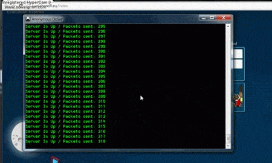
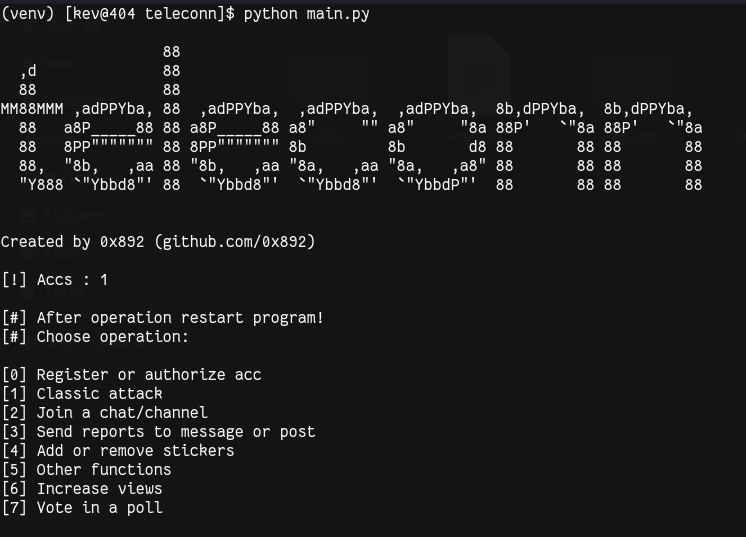

# 👽 teleconn 👽 
</img>
### This is a utility for simplifying certain actions in a telegram.

  
Requirements

<b><a href="https://www.python.org/downloads/release/python-31010/">Python 3.10</a> 
<a href="https://pypi.org/project/toml/"> toml </a> 
<a href="https://pypi.org/project/Telethon/"> telethon</a> 
<a href="https://pypi.org/project/datetime/"> datetime</a> 
<a href="https://pypi.org/project/asyncio/"> asyncio</a> </b>

  
Preview

  </img>

  
How to use?

  <i> Installing package. </i>
  <code>pip install -r requirements.txt</code>
  <i> Start code. </i>
  <code>python main.py</code>
  <b><i>And then it’s clear</i></b>  

